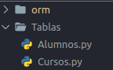

# orm.py
ORM basico creado para agilizar el manejo del *SGBD* SQLite, este ORM esta enfocado en el aprendizaje basico del funcionamiento de los ORM e introduccion al desarrollo de api rest.

Programado en el lemguaje de programacion python, haciendo uso de la programacion orientada a objetos.

Su linea de aprendizaje es baja y sus metodos para el manejo de CRUD en SQLite estan escritos en español facilitando el uso en los alumnos.
## Indice
- [1. Descarga y Uso del ORM](#1-descarga-y-uso-del-orm)
- [2. Creacion de una Base de Datos](#2-creacion-de-una-base-de-datos)
- [3. Creacion de Tablas](#3-creacion-de-tablas)
  * [3.1 Estructura de nuestra tabla](#31-estructura-de-nuestra-tabla)
  * [3.2 Crear Tabla](#32-crear-tabla)
- [4. Insertar Datos](#4-insertar-datos)
- [5. Actualizar Datos](#5-actualizar-datos)
- [6. Eliminar un Registro](#6-eliminar-un-registro)
- [7. Mostrar Datos](#7-mostrar-datos)
  * [7.1 mostrar todos los registros de una tabla](#71-mostrar-todos-los-registros-de-una-tabla)
  * [7.2 mostrar los registros que cumplan una condicion](#72-mostrar-los-registros-que-cumplan-una-condicion)
- [8. Cerrar Conexcion](#8-cerrar-conexcion)
---
### 1. Descarga y Uso del ORM [Indice](#indice)
- Para la descarga clonaremos el repositorio de la sigueinte manera
```bash
git clone https://github.com/hackanonimous/orm.py.git
``` 
- luego copiaremos la carpeta `orm` ala carpeta del proyecto donde haremos uso de sus metodos.

### 2. Creacion de una Base de Datos [Indice](#indice)
- primero importaremos nuestro orm en nuestro proyecto para esto tenemos varias maneras de hacerlo, podemos importar especificando directamente la class
```python
from orm import SQLiteORM
```
podemos importar dandole un alias
```python
import orm as db
```
o importa directamente toda la libreria
```python
import orm
```
una vez importado la libreria deberemos instancias la clase almacenandola en una variable.

una vez instanciada la clase deberemos pasarle como parametro el nombre de nuestra base de datos
```python
import orm

db=orm.SQLiteORM("mi_base_de_datos")
```
en estas lineas de codigo estamos creando muestra base de datos de nombre `mi_base_de_datos` y almacenaremos la conexcion en la variable `db` variable que nos dara acceso a los metodos con los cuales interactuaremos con nuestra base de datos creada.

### 3. Creacion de Tablas [Indice](#indice)
Para el proceso de la creacion de tablas tendremso que hacer uso de las siguientes convenciones para hacer mas entendible y legible el codigo

en la raiz de nuestro proyecto crearemos una carpeta de nombre `Tabla` dentro de esta carpeta crearemos por cada tabla un archivo en pascal case y en plural



**Recordemos**:cada archivo es una tabla, estos archivos almacenaran la estructura que tendra nuestra tabla
#### 3.1 Estructura de nuestra tabla [Indice](#indice)
En nuestro archivo la estructura sera la siguiente, pongamos el caso que deseamos crear una tabla para Alumnos en el archivo `Alumnos.py`
`Alumnos.py`
```python
Alumnos={
    "Alumnos":{
        "nombre":"TEXT",
        "apellidos":"TEXT",
        "edad":"INTEGER"
    }
}
``` 
en nuestro archivo `Alumno.py` crearemos nuestra variable `Alumnos` este sera un objeto con el nombre de la tabla que se creara y los campos con los tipos de datos que almacenaran, el campo `id` se crea automaticamente como autoincrement esto lo realiza internamente el `ORM`
#### 3.2 Crear Tabla [Indice](#indice)
Ubicandonos en nuestro archivo donde tenemos la conexcion primero importaremos el modelo de nuestra tabla y haremos uso de la variable que almacena la conexcion y hacemos el llamado a nuestro metodo que creara la tabla
```python
import orm
from Tabla.Alumnos import Alumnos
db=orm.SQLiteORM("mi_base_de_datos")

db.crear_tabla(Alumnos)
``` 
esto creara en nuestra base de datos `mi_base_de_datos` una tabla `Alumnos` con los campos y tipos de datos que le especificamos
### 4. Insertar Datos [Indice](#indice)
Para inserta datos en nuestra tabla creada tenemos dos metodos `insertarUno` e `insertarVarios` ambos metodos reciben dos parametros el primero sera el nombre de la tabla y el segudno parametro es el dato que deseamos almacenar la diferencia el metodo `insertarUno` recibe un solo objeto y el metodo `insertarVarios` recibe una lista de objetos
```python
#insertarUno
data={
    "nombre":"jose",
    "apellidos":"alvarez",
    "edad":30
}

db.insertarUno("Alumnos",data)
``` 
recordemos pasar la claves del objeto seran los campos de nuestra tabla creada
```python
#insertarVarios
data=[
    {
        "nombre":"jose",
        "apellidos":"alvarez",
        "edad":30
    },
    {
        "nombre":"milan",
        "apellidos":"alvarez",
        "edad":7
    }
]

db.insertarVarios("Alumnos",data)
``` 
### 5. Actualizar Datos [Indice](#indice)
Para actualizar los datos haremos uso del metodo `actualizar` recibira tres parametros el nombre de la tabla el objeto los campos y los datos que actualizaremos y como trecer parametro la condicion de busqueda del registro donde se actualizaran los datos
```python
data={"nombre":"jose luis"}
db.actualizar("Alumnos",data,"id=1")
#podemos actualizar mas de un campo de la sigueinte manera
data={"nombre":"jose luis","apellidos":"alvarez escobar"}
db.actualizar("Alumnos",data,"id=1")
``` 
la condicion de busqueda tambien podemos agregar nombre pero al ser datos de tipo texto tendremos que encerrarlos entre comillas simples `where="nombre=´jose´"`
### 6. Eliminar un Registro [Indice](#indice)
Para eliminar un registro de una tabla haremos uso del metodo `eliminar` que recibira dos parametros, el nombre de la tabla y la condicion de busqueda del registro a eliminar
```python
db.eliminar("Alumnos","id=70134578")
```
esto eliminara el registro cuyo id sea el numero 70134578
### 7. Mostrar Datos [Indice](#indice)
Para mostrar los registro que tiene nuestra tabla haremos uso del metodo `mostrar` tiene tres parametros el primero el nombre de la tabla los otros dos no son obligatorias nos ayudara a logras busquedas mas avanzadas
#### 7.1 mostrar todos los registros de una tabla [Indice](#indice)
```python
db.mostrar("Alumnos")
```
me trae todos los registro que tiene la tabla `Alumnos` en formato de lista de tuplas `[(),()]`,
si deseamo que la respuesta sea una lista de objetos usaremos el parametro `type="objeto"`
```python
db.mostrar("Alumnos",type="objeto")
```
#### 7.2 mostrar los registros que cumplan una condicion [Indice](#indice)
```python
db.mostrar("Alumnos",where="dni=70154867")
```
mostrara los registros que tengan el campo `dni` el numero `70154867`
```python
db.mostrar("Alumnos",where="nombre LIKE ´a%´")
db.mostrar("Alumnos",where="nombre LIKE ´%e´")
```
db.mostrar("Alumnos",where="nombre LIKE ´a%´")
me traera los registro en el primer caso de aquellos registros que en su campo `nombre` comienzen con la letra `a` en el segundo caso me traera los registros que en su campo `nombre` terminen con la letra `e`
```python
db.mostrar("Alumnos",where="edad > 20")
```
me mostra los registros que su campo `edad` sea mayor a `20`
### 8. Cerrar Conexcion [Indice](#indice)
Despues de ejecutar cualquiera de los metodos anteriores debemos cerra la conexcion para esto tenemso el metodo `cerrar`
```python
db.cerrar()
``` 